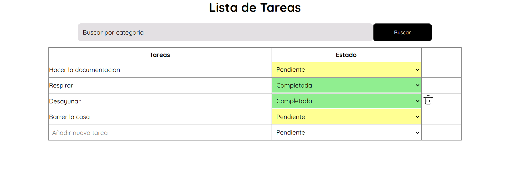

# Lista de Tareas 
Este proyecto es una lista de tareas que permite añadir una nuevas tareas, asignarles un estado, modificarlas, eliminarlas, asi como filtrarlas por estado.

## Objetivo 
Desarrollar una Lista de tareas con  seleccion de estado y filtros avanzados, aplicando conocimientos en:

* Lógica de programación 
* Manipulación del DOM
* Creación de clases y funciones
* Estructuración del código
* Diseño de una interfaz intuitiva

## Tecnologías utilizadas 
* HTML
* CSS
* JavaScript 
* Git
* GitHub 

## Componentes Principales 
* __Buscador por Estado:__ Filtra las filas por el estado seleccionado.

* __Lista de Tareas:__ Permite añadir una nueva fila con una tarea y su estado. Las tareas pueden ser modificadas o eliminadas y todos los cambios se guardan en el localStorage del navegador.

* __Estado:__ Permite seleccionar un estado mediante un select ,el cual cambia de color segun el estado elegido. Por ejemplo, el estado Completada se muestra de un color verde y pendiente en naranja.

* __Boton de Eliminar:__ Al pasar el cursor por una fila se muestra un icono que permite eliminarla, Esta accion actualiza automaticamente el almacenamiento local. 

### Captura de Pantalla

